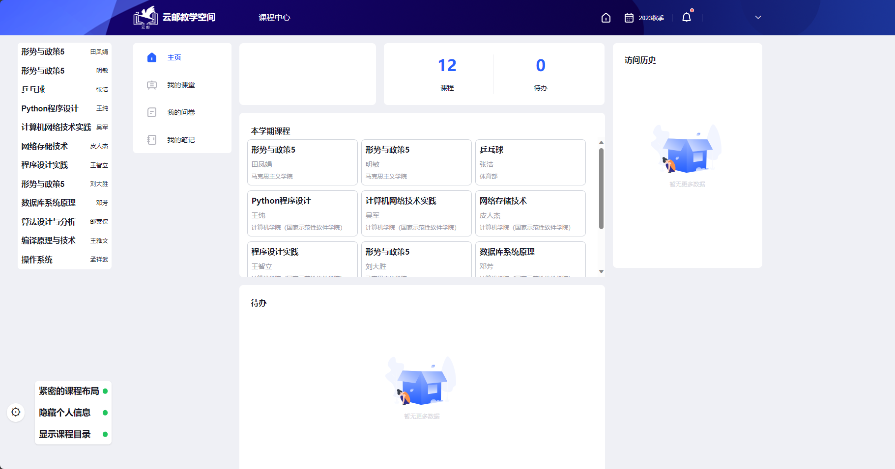

# ucloud_plus

> # 由于教学云平台已经升级，加上毕业客观原因，无法继续维护仓库 
> 
> 

北京邮电大学云邮教学空间优化脚本

为了优化云平台的部分交互体验，写了这样一个小脚本。

如果您想自己写一个更适合自己的脚本，欢迎参考本项目摸索出来的 [API 文档](docs/API.md)

- [安装](#安装)

## 安装

| jsDelivr 源                                                                          |
|-------------------------------------------------------------------------------------|
| [安装](https://fastly.jsdelivr.net/gh/5upernova-heng/ucloud_plus@master/dist/main.js) |

如果 TamperMonkey 没有自动检测，请手动到油猴的管理面板中通过 URL 添加。

## 功能

- 取消首页课程翻页，并删除无意义的图片
- 始终显示所有课程列表，便于跳转
- 一键下载所有课程资料

## 画饼

- [x] 更紧密的课程列表
- [x] 社恐模式（在页面中隐藏姓名班级信息）
- [x] bootstrap -> tailwind
- [ ] 下载时文件带有正确的文件名
- [ ] 隐藏不使用云平台的课程
- [ ] 更好的页面跳转逻辑
- [ ] 在课程作业页面首页直接显示作业内容摘要
- [ ] 插件设置

## 特别鸣谢

- [React](https://react.dev/)
- [Bootstrap](https://getbootstrap.com/)
- [Tailwind CSS](https://github.com/tailwindlabs/tailwindcss)
- [popper-core](https://github.com/popperjs/popper-core)
- [Bilibili-Evolved](https://github.com/the1812/Bilibili-Evolved)
